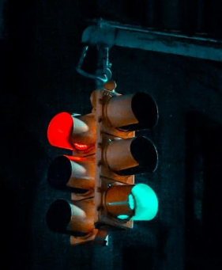
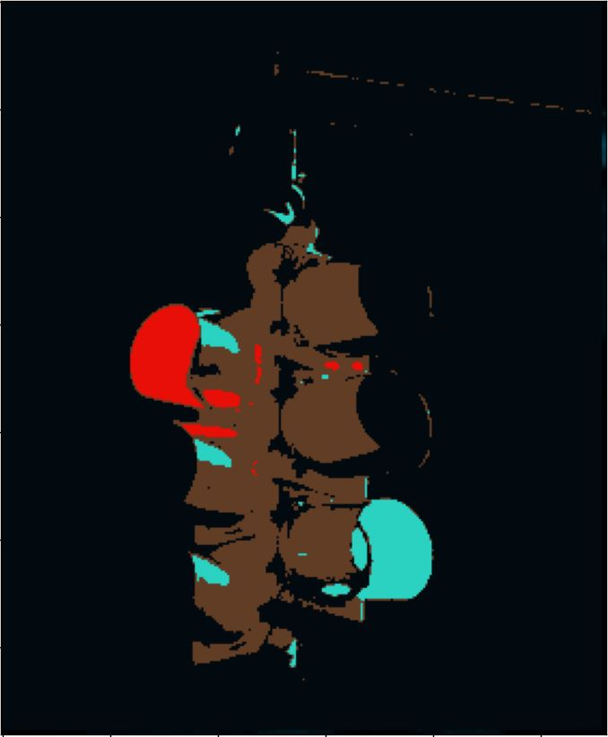

# Image Segmentation with K-Means

## Introduction

The goal of Image segmentation is to change the representation of an image into something that is more meaningful and easier to analyze. Through this project, I have implemented a Machine Learning technique, **K-Means**, to separate an image, based on colour, into 4 classes.

## Result
Original Image   |  Processed Image 
:-------------------------:|:-------------------------:
 |  

## Approach

The 'K'  for this problem is 4. The initial centroid estimates were red = (255,0,0), green = (0,255,0), blue = (0,0,255) and black = (0,0,0). The Euclidean distance between the RGB value of each pixel and the RGB value of the 4 centroids was calculated. Based on closeness to the centroid, each pixel was assigned a cluster. For each iteration, the initial centroid estimate is updated by finding the average'R', 'G' and 'B' value for the enitre cluseter set.

The logic is based on the equation below:

  

I have set the iteration to keep running until the New Centroid is within 1 unit Euclidean distance of the Old Centroid. [all pixels within the cluster are roughly the same shade.] Once we have are final centroid values, we use the 4 RGB values to Segment our image into the 4 colors.

## Support

For any questions, email me at jaisharm@umd.edu
